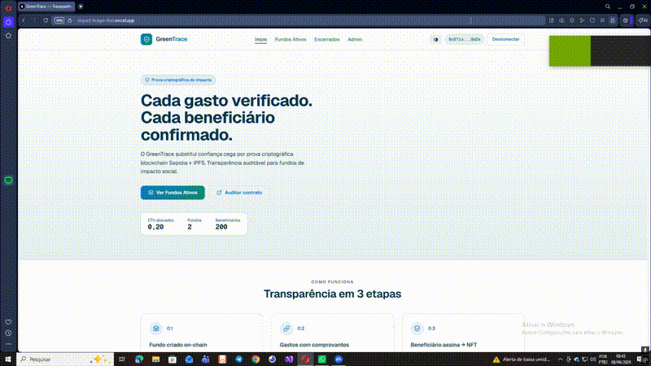

# GreenTrace rastreabilidade de Impacto Social On-Chain

> Plataforma blockchain para registro, rastreamento e certificação de ações de impacto social com auditabilidade pública e imutável.



## Aplicação Publicada

**https://impact-ledger-five.vercel.app/**

---

## Acesso Demo — Painel Administrativo

Para testar o painel de gestão completo, importe esta carteira no MetaMask:

```
Chave privada: 0x8a3bef974e11393ec1c2c9ca4350f11ad3a536a3d0fbf9d533de96877f8eff0d
Endereço:      0x871A2dE4748784b259BBD8ED203cb932A0E68d2e
Rede:          Sepolia Testnet (Chain ID: 11155111)
```

> ⚠️ Carteira exclusiva para demonstração Sepolia testnet, sem valor real.

**Como importar:**
1. MetaMask → ícone de conta → "Add account or hardware wallet" → "Import account"
2. Cole a chave privada acima e confirme
3. Certifique-se de estar na rede Sepolia
4. Acesse a aplicação e clique em "Conectar Carteira"

---

## Contratos Deployados — Sepolia Testnet

| Contrato | Endereço | Etherscan |
|----------|----------|-----------|
| GreenTrace (principal) | `0x1CFF6500625d6858826a92d6ce38B684e21E570b` | [Ver no Etherscan](https://sepolia.etherscan.io/address/0x1CFF6500625d6858826a92d6ce38B684e21E570b) |
| ImpactToken (ERC20Votes) | `0xE5870db9acc7165B5333ABc341CE8EdA5B6A01B5` | [Ver no Etherscan](https://sepolia.etherscan.io/address/0xE5870db9acc7165B5333ABc341CE8EdA5B6A01B5) |
| ImpactGovernance (DAO) | `0x5A2ADc4885665fF62120be3bf03D746B8FF76f39` | [Ver no Etherscan](https://sepolia.etherscan.io/address/0x5A2ADc4885665fF62120be3bf03D746B8FF76f39) |

**Deployer:** `0x871A2dE4748784b259BBD8ED203cb932A0E68d2e`  
**Deploy em:** 2026-06-04 — Sepolia Testnet

---

## Fluxo Principal

```
1. Admin cria um Fundo de Impacto (ex: "Fundo Alimentação 2026")
        ↓
2. Admin registra um Gasto com:
   - Descrição, valor em ETH e valor em BRL
   - Endereço do beneficiário
   - Evidência (PDF/imagem) enviada ao IPFS via Pinata
        ↓
3. GreenTrace emite automaticamente um NFT-certificado on-chain
   com SVG gerado inteiramente no contrato (sem dependência externa)
        ↓
4. Beneficiário confirma o recebimento diretamente on-chain
        ↓
5. Auditor valida a despesa (quando configurado)
        ↓
6. Qualquer pessoa acessa a URL pública e verifica:
   → o gasto no Etherscan
   → a evidência no IPFS
   → o certificado NFT
```

---

## O que fica On-Chain vs Off-Chain

| Dado | Onde fica | Por quê |
|------|-----------|---------|
| Nome do fundo, categoria, valor total | **On-chain** | Imutável, auditável |
| Valor gasto, beneficiário, timestamp | **On-chain** | Prova de execução |
| Hash IPFS da evidência | **On-chain** | Vincula o documento ao registro |
| Métricas de impacto (beneficiários, ODS) | **On-chain** | Rastreabilidade completa |
| NFT-certificado (SVG completo) | **On-chain** | Sem dependência de servidor externo |
| PDF/imagem da nota fiscal | **IPFS** | Custo de gas inviável on-chain |

---

## Arquitetura

```
┌──────────────────────────────────────────────┐
│             Frontend (Next.js 15)             │
│           Vercel  ·  ethers.js v6             │
└─────────────────────┬────────────────────────┘
                      │ MetaMask
         ┌────────────▼─────────────┐
         │      Sepolia Testnet      │
         │                           │
         │  ┌─────────────────────┐ │
         │  │     GreenTrace      │ │  ERC721 + Ownable + ReentrancyGuard
         │  │    (principal)      │ │  Fundos · Gastos · NFTs · Auditor
         │  └──────────┬──────────┘ │
         │             │             │
         │  ┌──────────▼──────────┐ │
         │  │    ImpactToken      │ │  ERC20Votes
         │  │   (governança)      │ │  Mintado por gasto confirmado
         │  └──────────┬──────────┘ │
         │             │             │
         │  ┌──────────▼──────────┐ │
         │  │  ImpactGovernance   │ │  DAO · Propostas · Votação
         │  │       (DAO)         │ │  Snapshot anti-double voting
         │  └─────────────────────┘ │
         └───────────────────────────┘
                      │
         ┌────────────▼─────────────┐
         │     IPFS via Pinata       │
         │  Evidências das ações     │
         └───────────────────────────┘
```

---

## Tecnologias

| Camada | Tecnologia |
|--------|-----------|
| Smart Contracts | Solidity 0.8.24 |
| Framework | Hardhat |
| Padrões | OpenZeppelin (ERC721, ERC20Votes, Ownable, ReentrancyGuard) |
| Rede | Sepolia Testnet |
| Carteira | MetaMask |
| Armazenamento descentralizado | IPFS via Pinata |
| Frontend | Next.js 15 + React 19 |
| Interação blockchain | ethers.js v6 |
| Deploy frontend | Vercel |

---

## Diferenciais Técnicos

- **NFT com SVG 100% on-chain** — certificado gerado inteiramente pelo contrato, sem servidor
- **ERC20Votes + snapshot por bloco** — governança segura, sem possibilidade de double voting
- **ReentrancyGuard** no fluxo de confirmação — proteção contra ataques de reentrância
- **Escape XML/JSON no SVG on-chain** — prevenção de injeção de código
- **Fluxo de auditoria opcional** — validação por auditor externo antes da confirmação final
- **Métricas ODS** — alinhamento com os 17 Objetivos de Desenvolvimento Sustentável da ONU
- **Valor em BRL + ETH** — cada gasto registra o equivalente em reais para prestação de contas local

---

## Como Executar Localmente

### Pré-requisitos
- Node.js 18+
- MetaMask instalado no browser
- ETH na Sepolia — obtenha em [sepoliafaucet.com](https://sepoliafaucet.com)

### 1. Instalar dependências

```bash
npm install
cd frontend && npm install && cd ..
```

### 2. Configurar variáveis de ambiente

```bash
cp .env.example .env
```

Edite `.env`:
```
PRIVATE_KEY=sua_chave_privada_da_carteira_deployer
SEPOLIA_RPC_URL=sua_url_rpc_sepolia
ETHERSCAN_API_KEY=sua_chave_etherscan
```

**Como obter cada valor:**

- **`PRIVATE_KEY`** — chave privada da carteira que vai fazer o deploy (apenas para redeploy; a aplicação já está deployada).

- **`SEPOLIA_RPC_URL`** — endpoint RPC da Sepolia. Opções gratuitas:
  - [Alchemy](https://alchemy.com): crie conta → "Create App" → rede Sepolia → copie a HTTPS URL  
  - [Infura](https://infura.io): crie conta → "Create New API Key" → selecione Sepolia → copie a endpoint URL  
  - Alternativa pública (sem cadastro, menos estável): `https://rpc.sepolia.org`

- **`ETHERSCAN_API_KEY`** — necessário apenas para verificar o código-fonte dos contratos no Etherscan. Opcional para rodar o frontend.  
  - [Etherscan](https://etherscan.io): crie conta → "My Profile" → "API Keys" → "Add" → copie a chave

```bash
cp frontend/.env.local.example frontend/.env.local
```

Edite `frontend/.env.local`:
```
NEXT_PUBLIC_CONTRACT_ADDRESS=0x1CFF6500625d6858826a92d6ce38B684e21E570b
NEXT_PUBLIC_TOKEN_ADDRESS=0xE5870db9acc7165B5333ABc341CE8EdA5B6A01B5
NEXT_PUBLIC_GOVERNANCE_ADDRESS=0x5A2ADc4885665fF62120be3bf03D746B8FF76f39
NEXT_PUBLIC_SEPOLIA_RPC=sua_url_rpc_sepolia
PINATA_JWT=seu_jwt_pinata
```

**Como obter cada valor:**

- **`NEXT_PUBLIC_CONTRACT_ADDRESS` / `NEXT_PUBLIC_TOKEN_ADDRESS` / `NEXT_PUBLIC_GOVERNANCE_ADDRESS`** — endereços dos contratos já deployados, listados na tabela acima. Se fizer redeploy próprio, o script `npm run deploy:sepolia` atualiza esses valores automaticamente.

- **`NEXT_PUBLIC_SEPOLIA_RPC`** — mesma URL RPC usada no `.env` do Hardhat (Alchemy, Infura ou `https://rpc.sepolia.org`).

- **`PINATA_JWT`** — token de autenticação para upload de evidências no IPFS. Obtenha em [app.pinata.cloud/developers/api-keys](https://app.pinata.cloud/developers/api-keys) → "New Key" → ative `pinFileToIPFS` → copie o JWT. Plano gratuito oferece 1 GB.

### 3. Rodar o frontend

```bash
npm run frontend:dev
# Acesse http://localhost:3000
```

### 4. (Opcional) Deploy próprio dos contratos

```bash
npm run deploy:sepolia
```

Deploya os 3 contratos, configura entre si, copia ABIs e atualiza o `.env.local` automaticamente.

---

## Scripts Disponíveis

```bash
npm run deploy:sepolia      # Deploy completo na Sepolia
npm run configure           # Reconfigurar contratos já deployados
npm run sync-env            # Sincronizar endereços com o frontend
npm run frontend:dev        # Frontend em desenvolvimento
npm run frontend:build      # Build de produção
npm test                    # Testes Hardhat
```

---

## Estrutura do Repositório

```
impactLedger/
├── contracts/
│   ├── GreenTrace.sol          # Contrato principal — fundos, gastos, NFTs
│   ├── ImpactToken.sol         # ERC20Votes — token de governança
│   └── ImpactGovernance.sol    # DAO — propostas e votação
├── scripts/
│   ├── deploy.js               # Deploy dos 3 contratos em sequência
│   ├── configure.js            # Configuração pós-deploy
│   └── sync-env.js             # Sincroniza endereços no frontend
├── deployments/
│   └── sepolia.json            # Endereços deployados (gerado automaticamente)
├── frontend/
│   └── src/
│       ├── app/                # Páginas Next.js (/, /admin, /fundos/*)
│       ├── components/         # Componentes React
│       └── lib/                # Hooks, funções de contrato, ABIs
└── hardhat.config.js
```

## Uso de IA no Desenvolvimento

O Claude AI foi utilizada como ferramenta de apoio à produtividade em partes específicas do projeto:

- **Scaffolding do frontend**:  geração inicial de componentes React e estrutura de páginas Next.js
- **Scripts auxiliares**: rascunho de `deploy.js` e `sync-env.js`
- **Documentação**: apoio na redação e formatação deste README
- **Debugging pontual**:  consultas sobre edge cases do OpenZeppelin durante o desenvolvimento

---

## Licença

Copyright (c) 2026 Thales Fortes — Todos os direitos reservados.  
É proibido copiar, modificar ou distribuir este software sem autorização prévia e por escrito do autor.  
Veja o arquivo [LICENSE](./LICENSE) para mais detalhes.
